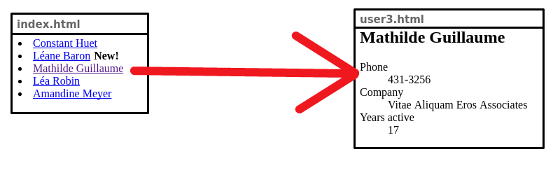

# Indexed Page Scrapper

**Indexed Page Scrapper** is a simple tool aimed at Python developers who want to scrap, filter and transform a content that is listed on a index page.

**Eg:** Say you want to scrap an [old user's directory](https://en.wikipedia.org/wiki/Telephone_directory) from your organization. This directory is organized in such a way that there's an index page with links to user's content pages. Your job is to scrap each of the user's pages starting from this index page.



## Motivation

The motivation behind this package is to find an easier way developers can grab information from websites that follows an indexed directory pattern.

## How it works

First you need to install this package. Since we haven't released it to PyPI yet, you should just clone this repository.

*TODO: release package to PyPI*

Once the package is installed, you can create your own scrapper. Jump to your code editor, import our `Scrapper` class, and subclass it. This class have two abstract functions: `getLinks` and `getData`.

```python
from Scrapper import Scrapper

class MyScrapper(Scrapper):
    def getLinks(self, tree):
        pass

    def getData(self, tree):
        pass
```

### `getLinks`

We use this method to scrap the index page for links pointing to the content pages. In the user's directory example, this method should return links to each user's page.

### `getData`

This method receives a parsed content page as a parameter. Use this parameter to scrap the content page and return a key-value map representation of its data.

### Example

Here's a simple example of a `Scrapper` implementation. Note that the first function returns URIs listed on the page. These URIs will be fetched, and its results will be passed to the next function.

In the next function you can get the parsed page and return a dictionary representation of its scrapped content.

```python
from Scrapper import Scrapper

class MyScrapper(Scrapper):
    def getLinks(self, tree):
        # Return a list of uris listed on the index page
        return map(lambda a_tag: a_tag.get('href'), tree.find_all('a'))

    def getData(self, tree):
        # Each uri will be fetched, parsed and given to you so you can return its data from this method
        return {'name': tree.find(id='name').get_text(), 'phone': tree.find(id='phone').get_text()}

if __name__ == '__main__':
    # Pass in the constructor the url of the index page
    scrapper = MyScrapper('http://some-web-page/index.html')
    # Create an iterable
    users = scrapper.execute()

    # Print scrapped content
    for u in users:
        print u
```

For a working code, please refer to our [first example](examples/example1/example1.py) in our [examples guide](examples/).

## Resolvers

Sometimes scrapping data is not enough. You may want to perform some operations on it: filter relevant data, limit the output to a given number, apply transformation to the fields, or even download some content.

For that reason we have some built-in resolvers that can be used on your scrapped data.

Resolvers operates on the output data. You can think of them as some pre-build functions that will be used in a `map()` over the resulting iterable.

These operations are [lazy](https://en.wikipedia.org/wiki/Lazy_evaluation) -- i.e., they don't have to wait for the scrapping to finish to start evaluating the output data. This is useful because some resolvers may decide to terminate earlier (before fetching all pages).

### Example

```python
scrapper = MyScrapper()
users = (scrapper
    .addResolver(resolvers.Filter(lambda data: data['name'] == 'Adam'))
    .addResolver(resolvers.Limit(10))
    .execute())

for u in users:
    print u

# Will print a list of all the users whose name is "Adam" (Filter) but just return the first 10 results (Limit)
```

For a complete list of resolvers, please refer to the [resolvers guide](resolvers/)

Example [3](examples/example3/example3.py) and [4](examples/example4/example4.py) makes use of resolvers.

## Examples

If the examples above were not enough, there are some working code in our [examples page](examples/). Each have some new features added to it.

Also, if you wish to learn more about resolvers, we show some code snippets for each of them in our [resolvers guide](resolvers/).

## Dependencies

**Indexed Page Scrapper** has two dependencies that are quite optional: [requests](http://python-requests.org) for page fetching, and [BeautifulSoup](http://www.crummy.com/software/BeautifulSoup/) for HTML parsing.

It comes with them by default so you don't have to implement even more functions. But if you wish to use you your own HTTP library or HTML parsing library, overwrite these two methods: `fetchPage(url)` and `parsePage(page)`.

## Contact

This library is authored by Mailson Menezes. I have a **gmail** account and my username is **mailson**.
